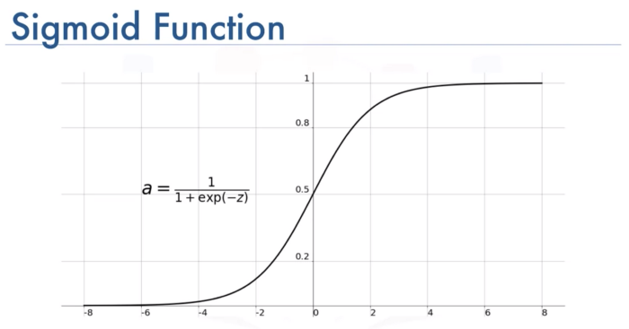

# Image 모델

## 알아야될 내용들

1. Flatten Layer
    - 2D로 되어 있는 이미지를 1D로 펼쳐주는 작업을 해주는 Layer
        ```python
        Flatten(input_shape=(10,10))
        ```

2. 활성함수들(Activation Function)
    - Relu
      

    - Softmax
      
        - Softmax의 롹률 합은 항상 1 임.
        - 분류할때 분류의 갯수가 2보다 클때 사용.
        - ex) 5개로 분류할때, 마지막 Layer에 사용
         ```python
             Dense(5, activation='softmax')
         ```

    - sigmoid
      

3. 최종 Layer와 loss는 다음과 같이 설정한다.
    1. ox 분류
      - Dense(1,activation='sigmoid')
      - binary_crossentropy
    2. 다중 분류
      - Dense(분류갯수, activation='softmax')
      - categorical_crossentropy (원핫)
      - sparse_categorical_crossentropy (원핫 아닐때)
   
4. 원 핫 이란?
   
   0~4 의 4개의 분류를 사용한다고 하자. 이때, 원핫 인코딩일때에는 [0,0,1,0]로 y값을 표기하고
   원핫이 아닐때는 2 라고 y값을 표현한다.
   
   
##전체 소스   
```python
model = Sequential([
    Flatten(input_shape=(10, 10)),
    Dense(512, activation='relu'),
    Dense(256, activation='relu'),
    Dense(128, activation='relu'),
    Dense(64, activation='relu'),
    Dense(10, activation='softmax'),
])
model.compile(optimizer='adam', loss='sparse_categorical_crossentropy', metrics=['acc'])
checkpoint_path = "checkpoint.ckpt"
checkpoint = ModelCheckpoint(filepath=checkpoint_path, 
                             save_weights_only=True, 
                             save_best_only=True, 
                             monitor='val_loss', 
                             verbose=1)
history = model.fit(x_train, y_train,
                    validation_data=(x_valid, y_valid),
                    epochs=20,
                    callbacks=[checkpoint],
                   )
                   
model.load_weights(checkpoint_path)
model.evaluate(x_valid, y_valid)
```


#tensorflow-datasets 전처리

```python
train_dataset = tfds.load('iris', split='train[:80%]')
test_dataset = tfds.load('iris', split='train[80%:]')

def preprocess(data):
   x = data['features']
   y = data['label']
   y = tf.one_hot(y, 3)
   return x, y
   
batch_size=10
train_data = train_dataset.map(preprocess).batch(batch_size)
test_data = test_dataset.map(preprocess).batch(batch_size)

model = tf.keras.models.Sequential([
    Dense(512, activation='relu', input_shape=(4,)),
    Dense(256, activation='relu'),
    Dense(128, activation='relu'),
    Dense(64, activation='relu'),
    Dense(32, activation='relu'),
    Dense(3, activation='softmax'),
])
model.compile(optimizer='adam', loss='categorical_crossentropy', metrics=['acc'])
checkpoint_path = "my_checkpoint.ckpt"
checkpoint = ModelCheckpoint(filepath=checkpoint_path, 
                             save_weights_only=True, 
                             save_best_only=True, 
                             monitor='val_loss', 
                             verbose=1)
                             
history = model.fit(train_data,
                    validation_data=(valid_data),
                    epochs=20,
                    callbacks=[checkpoint],
                   )
                   
```

#시각화
```python
import matplotlib.pyplot as plt
#오차 시각화
plt.figure(figsize=(12, 9))
plt.plot(np.arange(1, 21), history.history['loss'])
plt.plot(np.arange(1, 21), history.history['val_loss'])
plt.title('Loss / Val Loss', fontsize=20)
plt.xlabel('Epochs')
plt.ylabel('Loss')
plt.legend(['loss', 'val_loss'], fontsize=15)
plt.show()

#정확도 시각화
plt.figure(figsize=(12, 9))
plt.plot(np.arange(1, 21), history.history['acc'])
plt.plot(np.arange(1, 21), history.history['val_acc'])
plt.title('Acc / Val Acc', fontsize=20)
plt.xlabel('Epochs')
plt.ylabel('Acc')
plt.legend(['acc', 'val_acc'], fontsize=15)
plt.show()
```