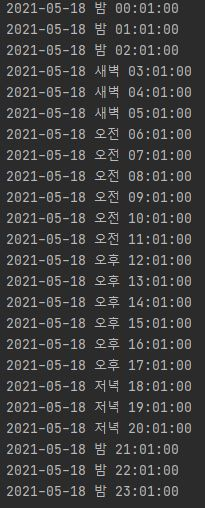

#JAVA16 변경점

안녕하세요 홍성훈 입니다.

오늘은 자바 16버전 변경점을 정리해보려 합니다.

언제나 테클은 환연합니다.


##DateTimeFormatter에 'B' 추가
새로운 포맷터 패턴, 문자 'B'및 지원 방법이 java.time.format.DateTimeFormatter/DateTimeFormatterBuilder클래스 에 추가되었습니다 . day periods유니 코드 컨소시엄의 CLDR ( https://unicode.org/reports/tr35/tr35-dates.html#dayPeriods )에 정의 된 패턴 및 메서드 변환 입니다. 이제 애플리케이션은 오전 / 오후뿐만 아니라 "아침"또는 "야간"과 같은 하루의 기간을 표현할 수 있습니다. 다음 예제는 일 기간 변환을 보여줍니다.

```java
LocalDateTime localDateTime = LocalDateTime.of(2021,05,18,0,1);
for(int i=0;i<24;i++){
    System.out.println(DateTimeFormatter.ofPattern("YYYY-MM-dd B HH:mm:ss").format(localDateTime.plusHours(i)));
}
```

결과
21~03 시는 밤으로 표기하고
03~06 시는 새벽으로 표기해준다.




##Stream.toList () 메서드 추가
Stream인터페이스에만 추가된것으로 보이고 실제로는 에러가 남.
앞으로 확장성을 위해 추가한 것으로 보임.

##Z Garbage Collector 동시 스택 처리
Z Garbage Collector는 이제 스레드 스택을 동시에 처리합니다. 이를 통해 JVM의 모든 루트가 Stop The World하는 대신 동시 단계에서 ZGC에 의해 처리 될 수 있습니다. ZGC 일시 중지에서 수행되는 작업의 양은 이제 일정 해졌으며 일반적으로 몇백ms를 초과하지 않습니다.

##G1 Garbage Collector
- G1이 Java 힙 메모리를 운영 체제에 반환하는 시간을 변경합니다
- G1은 여전히 GC 일시 중지 시 사이징 결정을 내리지만, Java 애플리케이션과 동시에 실행되는 스레드로 비용이 많이 드는 작업을 없앱니다.


