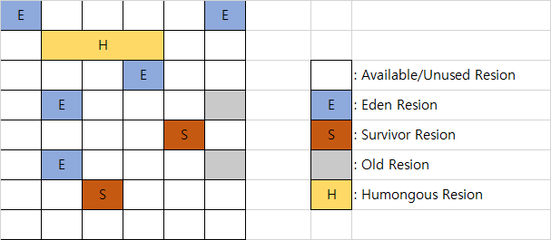

안녕하세요 selest 입니다.

오늘은 G1 GC에 대해 정리해보려 합니다.

언제나 테클은 환영합니다.

##G1GC

Garbage First Garbage Collector

###G1GC에 대하여
- 가득찬 Heap 영역을 집중적으로 수집한다.
- 큰 메모리를 가진 멀티 프로세서 시스템에서 사용하기 위해 개발된 GC이다.
- Java6 에서 early access.
- Java7 부터 정식 제공.
- Java9 부터 디폴트 GC이다.
- 큰 힙 메모리에서 짧은 STW 시간 보장

위 이미지는 G1 GC의 Heap Layout이다.

여기에서 Eden, Survivor region은 Young Generation이고,

Humongous, Old region은 Old Generation이다. 

- Available/Unused : 아직 사용되지 않은 Region
- Humongous : Region 크기의 50%를 초과하는 큰 객체를 저장하기 위한 공간이며, 이 Region 에서는 GC 동작이 최적으로 동작하지 않는다.
  
G1 GC는 전체 heap영역을 일정한 크기의 여러 영역(region)으로 나누어 관리한다.
일반적으로 Region의 크기는 1~32MB이고 대략 2000개의 Region으로 분할한다.

이 영역을 참조하면서 관리하기 위하여 remember set을 만들어 사용한다.

---
###Young GC
G1 GC에서 Young GC 를 수행할 때는 STW(Stop-The-World) 현상이 발생하며,
STW 시간을 최대한 줄이기 위해 멀티스레드로 GC를 수행한다.

- eden이 용량 한계에 다다르면 Young garbage collection이 발생한다.
   살아있는 객체들을 eden region부터 survivor region으로 이동하는데 이때 STW가 발생한다.
   살아남은 횟수가 한계를 넘으면 old region으로 이동하게된다.

---
###Full GC 작동방식
1. Initial Mark
    - Old Region 에 존재하는 객체들이 참조하는 Survivor Region 을 찾는다. 이 과정에서는 STW 현상이 발생하게 된다.

1. Root Region Scan
    - Initial Mark 에서 찾은 Survivor Region에 대한 GC 대상 객체 스캔 작업을 진행한다.

1. Concurrent Mark
    - 전체 힙의 Region에 대해 스캔 작업을 진행하며, GC 대상 객체가 발견되지 않은 Region 은 이후 단계를 처리하는데 제외되도록 한다.
    
1. Remark
    - 애플리케이션을 멈추고(STW) 최종적으로 GC 대상에서 제외될 객체(살아남을 객체)를 식별해낸다.
    
1. Cleanup
    - 애플리케이션을 멈추고(STW) 살아있는 객체가 가장 적은 Region 에 대한 미사용 객체 제거 수행한다. 이후 STW를 끝내고, 앞선 GC 과정에서 완전히 비워진 Region 을 Freelist에 추가하여 재사용될 수 있게 한다.
    
1. Copy
    - GC 대상 Region이었지만 Cleanup 과정에서 완전히 비워지지 않은 Region의 살아남은 객체들을 새로운(Available/Unused) Region 에 복사하여 Compaction 작업을 수행한다.

---
참고
- https://mirinae312.github.io/develop/2018/06/04/jvm_gc.html
- https://luavis.me/server/g1-gc
- https://imp51.tistory.com/entry/G1-GC-Garbage-First-Garbage-Collector-Tuning

