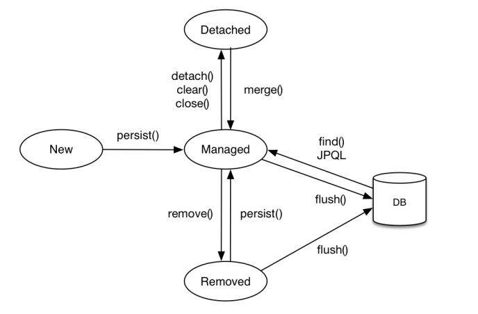

#JPA
##영속성 컨텍스트
###상태
- 비영속(New)
- 영속(Managed)
- 준영속(Detached)
- 삭제(Removed)
---
###영속성 생명주기

---
###이점
- 1차 캐시
  - 트랜잭션 내에서만 1차캐시 유지, 트랜잭션 끝나면 1차캐시 삭제(entityManager 삭제)
- 동일성 보장
- 트랜잭션 쓰기 지연
    - 여러건의 insert가 있어도 그때그때 실행하는것이 아닌 commit 시점에 모두 실행함(예외 있음)
    - 쓰기 지연 SQL 저장소에 저장해뒀다가 한번에 전송
- 변경 감지
    1. flush()
    2. 엔티티와 스냅샷 비교
    3. Update Sql 생성
    4. flush
    5. commit
- 지연 로딩
---
###Flush
- 영속성 컨텍스트의 변경내용을 데이터베이스에 반영
- 영속성 컨텍스트를 비우지 않음
####Flush시점
- em.flush()
- 트랜잭션 커밋 - Flush자동 호출
- JPQL 쿼리 실행 - Flush 자동 호출

###준영속 상태
####준영속 상태로 만드는 방법
- em.detach(entity)
- em.clear()
- em.close()